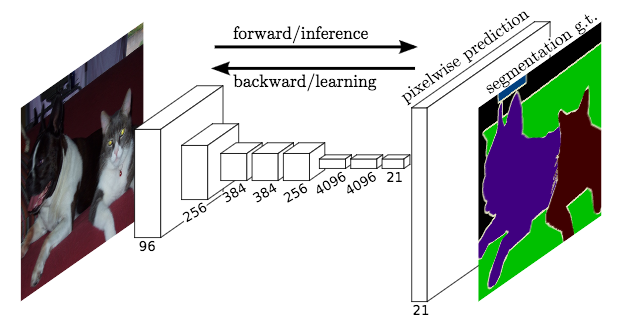

# Semantic Segmentation
### Introduction
The goal of this project is to identify roads in pictures using semantic segmentation where pixel-wise classification is performed. A Fuly Convolutional Network (FCN) will be trained to label each pixel in the given picture as a road or not-road. 

### Setup
##### Frameworks and Packages
Make sure you have the following is installed:
 - [Python 3](https://www.python.org/)
 - [TensorFlow](https://www.tensorflow.org/)
 - [NumPy](http://www.numpy.org/)
 - [SciPy](https://www.scipy.org/)

You may also need [Python Image Library (PIL)](https://pillow.readthedocs.io/) for SciPy's `imresize` function.

##### Dataset
Download the [Kitti Road dataset](http://www.cvlibs.net/datasets/kitti/eval_road.php) from [here](http://www.cvlibs.net/download.php?file=data_road.zip).  Extract the dataset in the `data` folder.  This will create the folder `data_road` with all the training a test images.

### Start
##### Implement
Implement the code in the `main.py` module indicated by the "TODO" comments.
The comments indicated with "OPTIONAL" tag are not required to complete.
##### Run
Run the following command to run the project:
```
python main.py
```

### Architecture
The FCN used in this project consists of two parts: an encoder and decoder.

<p align="center">  </p>

#### FCN-8 Encoder
The encoder network is based on the FCN-8 architecture developed at UC-Berkeley.  The encoder for FCN-8 is the VGG16 model pretrained on ImageNet for classification. The fully-connected layers are replaced by 1-by-1 convolutions. Here’s an example of going from a fully-connected layer to a 1-by-1 convolution in TensorFlow:
```python
num_classes = 2
# Replace the following:
output = tf.layers.dense(input, num_classes)
# with:
output = tf.layers.conv2d(input, num_classes, 1, strides=(1,1))

```

#### FCN-8 - Decoder
To build the decoder portion of FCN-8, the input is upsampled to the original image size. The shape of the tensor after the final convolutional transpose layer will be 4-dimensional: (batch_size, original_height, original_width, num_classes). Let’s implement those transposed convolutions we discussed earlier as follows:

```python
output = tf.layers.conv2d_transpose(input, num_classes, num_filters, strides=(2, 2))
```

### Training
The FCN was trained on the Kitti dataset using TensorFlow's Adam optimizer. A total of 50 epochs with a batch size of 10 images, learning rate of 0.001, and droup-out rate of 50% were found to be sufficient to produce reasonable segmentation performance. As can be shown in the following plot, the model's loss pretty much flattens beoynd 40 epochs.


<p align="center">  </p>

### Test Samples
The following images show the classifier's output on out-of-sample test images where most road pixels are correctly classified.

<p align="center">  </p>
<p align="center">  </p>
<p align="center">  </p>
<p align="center">  </p>


 
### Tips
- The link for the frozen `VGG16` model is hardcoded into `helper.py`.  The model can be found [here](https://s3-us-west-1.amazonaws.com/udacity-selfdrivingcar/vgg.zip).
- The model is not vanilla `VGG16`, but a fully convolutional version, which already contains the 1x1 convolutions to replace the fully connected layers. Please see this [post](https://s3-us-west-1.amazonaws.com/udacity-selfdrivingcar/forum_archive/Semantic_Segmentation_advice.pdf) for more information.  A summary of additional points, follow. 
- The original FCN-8s was trained in stages. The authors later uploaded a version that was trained all at once to their GitHub repo.  The version in the GitHub repo has one important difference: The outputs of pooling layers 3 and 4 are scaled before they are fed into the 1x1 convolutions.  As a result, some students have found that the model learns much better with the scaling layers included. The model may not converge substantially faster, but may reach a higher IoU and accuracy. 
- When adding l2-regularization, setting a regularizer in the arguments of the `tf.layers` is not enough. Regularization loss terms must be manually added to your loss function. otherwise regularization is not implemented.

### Why Layer 3, 4 and 7?
In `main.py`, you'll notice that layers 3, 4 and 7 of VGG16 are utilized in creating skip layers for a fully convolutional network. The reasons for this are contained in the paper [Fully Convolutional Networks for Semantic Segmentation](https://arxiv.org/pdf/1605.06211.pdf).

In section 4.3, and further under header "Skip Architectures for Segmentation" and Figure 3, they note these provided for 8x, 16x and 32x upsampling, respectively. Using each of these in their FCN-8s was the most effective architecture they found. 

### Optional sections
Within `main.py`, there are a few optional sections you can also choose to implement, but are not required for the project.

1. Train and perform inference on the [Cityscapes Dataset](https://www.cityscapes-dataset.com/). Note that the `project_tests.py` is not currently set up to also unit test for this alternate dataset, and `helper.py` will also need alterations, along with changing `num_classes` and `input_shape` in `main.py`. Cityscapes is a much more extensive dataset, with segmentation of 30 different classes (compared to road vs. not road on KITTI) on either 5,000 finely annotated images or 20,000 coarsely annotated images.
2. Add image augmentation. You can use some of the augmentation techniques you may have used on Traffic Sign Classification or Behavioral Cloning, or look into additional methods for more robust training!
3. Apply the trained model to a video. This project only involves performing inference on a set of test images, but you can also try to utilize it on a full video.
 
### Using GitHub and Creating Effective READMEs
If you are unfamiliar with GitHub , Udacity has a brief [GitHub tutorial](http://blog.udacity.com/2015/06/a-beginners-git-github-tutorial.html) to get you started. Udacity also provides a more detailed free [course on git and GitHub](https://www.udacity.com/course/how-to-use-git-and-github--ud775).

To learn about REAMDE files and Markdown, Udacity provides a free [course on READMEs](https://www.udacity.com/courses/ud777), as well. 

GitHub also provides a [tutorial](https://guides.github.com/features/mastering-markdown/) about creating Markdown files.
